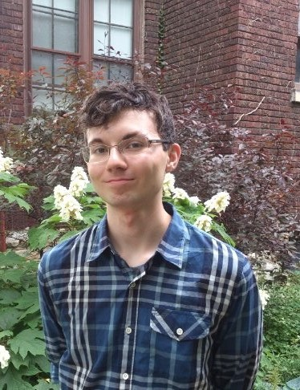
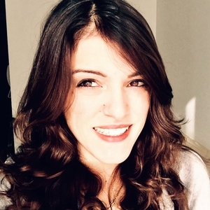
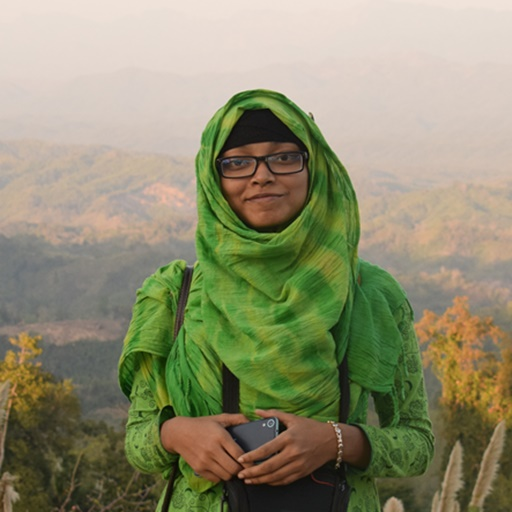
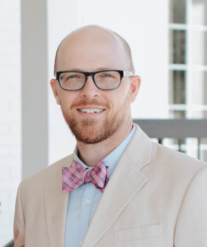
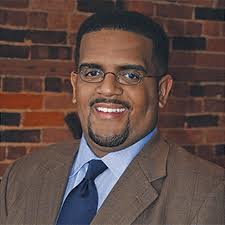
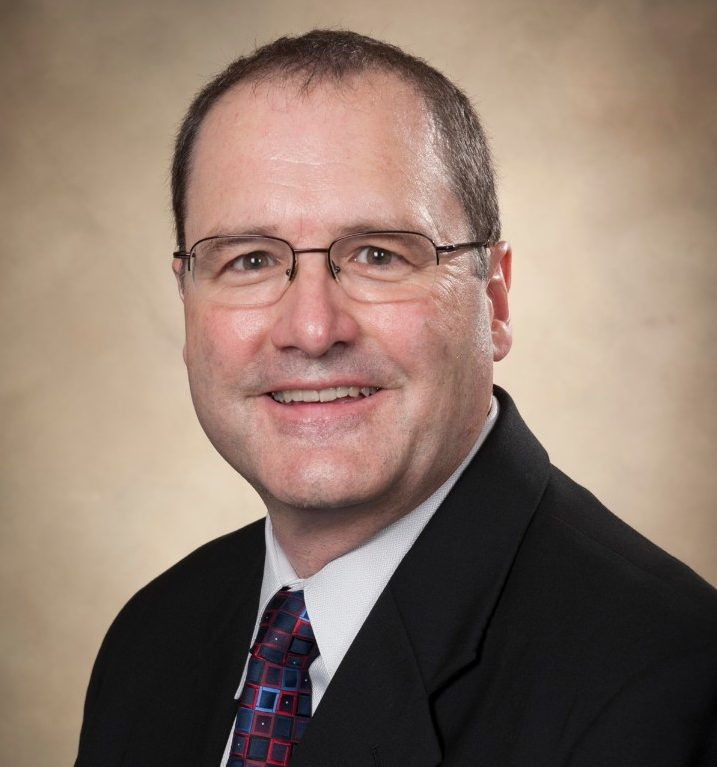
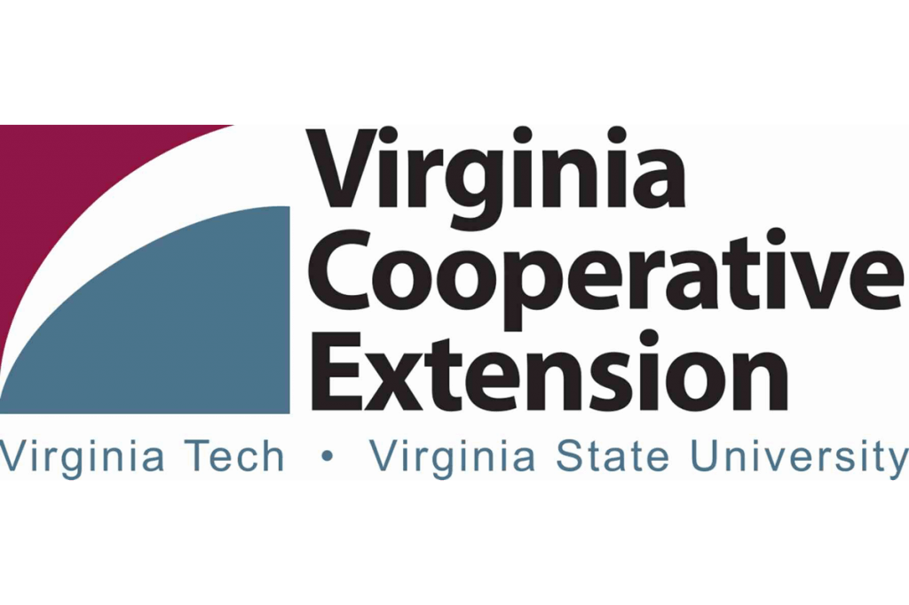

```{css, echo=FALSE}
/* this chunnk of code centers all of the headings */
h1, h2, h3 {
  text-align: center;
}
```

### Data Science for the Public Good Program


The Data Science for the Public Good (DSPG) Young Scholars program(https://biocomplexity.virginia.edu/social-decision-analytics/dspg-program) is a summer immersive program held at the [Biocomplexity Institute’s Social and Decision Analytics division (SDAD)](https://biocomplexity.virginia.edu/social-decision-analytics).
In its seventh year, the program engages students from across the country to work together on projects that address state, federal, and local government challenges around critical social issues relevant in the world today. DSPG young scholars conduct research at the intersection of statistics, computation, and the social sciences to determine how information generated within every community can be leveraged to improve quality of life and inform public policy. For more information on program highlights, how to apply, and our annual symposium, please visit the official [Biocomplexity DSPG website]((https://biocomplexity.virginia.edu/social-decision-analytics/dspg-program)).

### 2020 Richmond City Summer Project

### DSPG Team Members {style=text-align:center}

<center>
{width=150px height=160px}{width=150px height=160px}{width=150px height=160px}
{width=150px height=160px}{width=150px height=160px}

[Boya Zhang, Fellow (PhD Student at Virginia Tech, Statistics)](https://github.com/boya66)

[Dylan Glover, Intern (Undergraduate Student at Virginia Tech, Mathematics)](https://github.com/dyglover)

[Laura Pranteddu, Intern (Master Student at University of Trento, Data Science)](https://github.com/lp9kh) 

[Afrina Tabassum, Intern (PhD student at University of Trento, Computer Science)](https://github.com/afrinaVT)    

[Adam Wells, Intern (Master Student at Virginia Tech, Data Analysis and Applied Statistics)](https://github.com/wellay01)

### VT Faculty Team Members {style=text-align:center}

<center>
{width=150px height=160px}{width=150px height=160px}{width=150px height=160px}{width=150px height=160px}

[Susan Chen (Associate Professor at Virginia Tech, Agricultural & Applied Economics)](https://aaec.vt.edu/people/faculty/chen-susan.html), [Ford Ramsey (Assistant Professor at Virginia Tech, Agricultural & Applied Economics, DSPG Project Lead)](https://aaec.vt.edu/people/faculty/ramsey-ford.html), [Conoway Haskins (Extension Specialist at Virginia Cooperative Extension)](https://ext.vt.edu/community-leadership/people/conaway-haskins.html), [Matt Holt (Department Head, Professor, Agribusiness, Applied Econometrics, Principal Investigator)](https://aaec.vt.edu/people/faculty/holt-matthew.htmln)

### Project Sponsors/Stakeholders {style=text-align:center}
<center>
{width=300px height=200px}
<center>

[Twandra Lomax-Brown (Unit Coordinator Extension Agent, Family and Consumer Sciences)](https://www.linkedin.com/in/twandra-lomax-brown-ma-ed-5554859/)


### Acknowledgements {style=text-align:center}

We would like to acknowledge the support from our stakeholders.
  
  Thank You!
